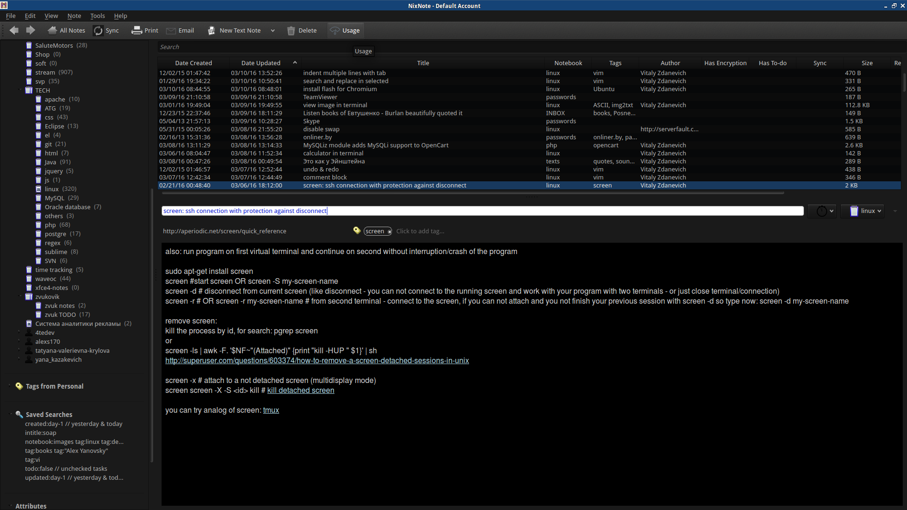

# NixNote2

## Introduction

An unofficial client of Evernote for Linux.



## Installation

### Debian and Ubuntu

#### Install from distribution repository

For users of Debian Stretch (Debian 9), Debian unstable and Ubuntu 17.04+, you may install
from the official repositories. This will become the stable release we will encourage users to install.

```bash
sudo apt update
sudo apt install nixnote2
```

You may find the package information on [Debian PTS](https://tracker.debian.org/pkg/nixnote2).

#### Install via daily PPA

For testing the very latest functionality, there is an unstable Daily-build PPA for Debian/Ubuntu (provided by [artmg](https://github.com/artmg/nixnote2-packaging/wiki)). This is _only_ recommended for Advanced users.

```bash
sudo add-apt-repository ppa:nixnote/nixnote2-daily
sudo apt update
sudo apt install nixnote2
```

### Arch Linux

NixNote2 is available via AUR: [nixnote-beta](https://aur.archlinux.org/packages/nixnote-beta/),
[nixnote](https://aur.archlinux.org/packages/nixnote/).

These packages are also available in [[archlinuxcn]](https://www.archlinuxcn.org/archlinux-cn-repo-and-mirror/)
unofficial repository.

### Gentoo Linux

NixNote is acailable via gentoo-zh overlay, you can install by:

```bash
# run with root privileges
layman -a gentoo-zh
emerge nixnote:1 # to install nixnote-1.6
# or
emerge nixnote:2 # to install nixnote-2.0
```

### RPM package on Copr

The NixNote2 package for Fedora and other distros using RPM packages is now on Copr, provided by [Nuno Dias](http://copr-dist-git.fedorainfracloud.org/cgit/nunodias/nixnote2/).

```bash
dnf copr enable nunodias/nixnote2
dnf install nixnote2

# OR for OLDER Distros using yum
yum copr enable nunodias/nixnote2
yum install nixnote2
```
